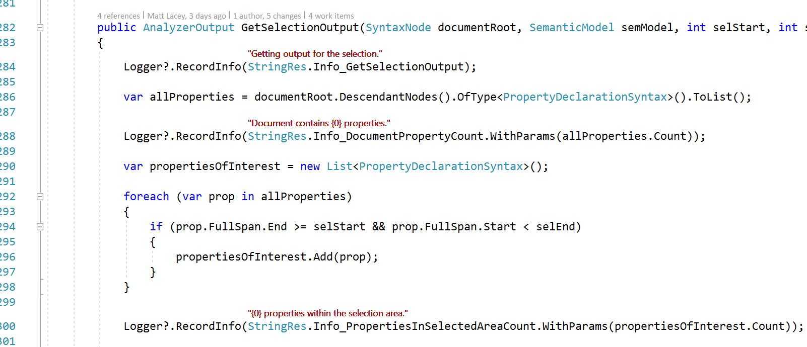

# String Resource Visualizer

Download the extension from the [VS Marketplace](???????)
or get the
[nightly build](?????)

------------------------------------

Visual Studio extension that shows the text of a string resource (.resx or .resw) when used inline in code.

See the [change log](CHANGELOG.md) for changes and road map.

## Contribute

Check out the [contribution guidelines](CONTRIBUTING.md) if you want to contribute to this project.

For cloning and building this project yourself, make sure to install the
[Extensibility Tools](https://visualstudiogallery.msdn.microsoft.com/ab39a092-1343-46e2-b0f1-6a3f91155aa6)
extension for Visual Studio which enables some features used by this project.

## License

[MIT](LICENSE)
