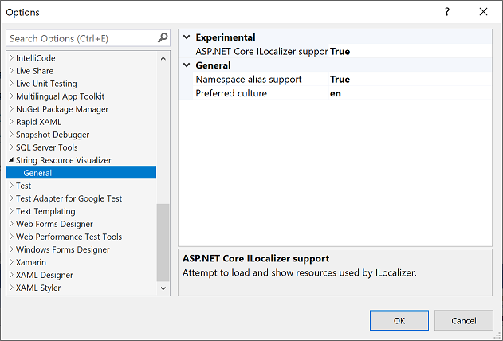

# String Resource Visualizer

A [Visual Studio extension](https://marketplace.visualstudio.com/items?itemName=MattLaceyLtd.StringResourceVisualizer) that shows the text of a string resource (.resx) when used inline in code.

The default (language/culture agnostic) resource file is used to find the text to display but you can override this by specifying a **Preferred Culture** in settings. (Go to **Tools > Options > String Resource Visualizer**)

If a string is not specified for the preferred culture, the default value is used instead.

See the [change log](CHANGELOG.md) for changes and road map.

## Contribute

Check out the [contribution guidelines](CONTRIBUTING.md) if you want to contribute to this project.

For cloning and building this project yourself, make sure to install the
[Extensibility Tools](https://visualstudiogallery.msdn.microsoft.com/ab39a092-1343-46e2-b0f1-6a3f91155aa6)
extension for Visual Studio which enables some features used by this project.
